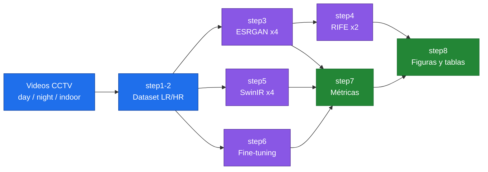
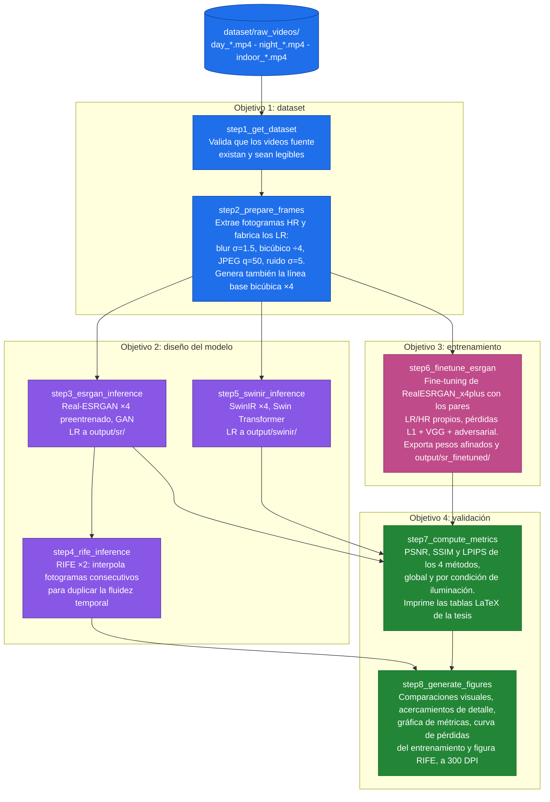
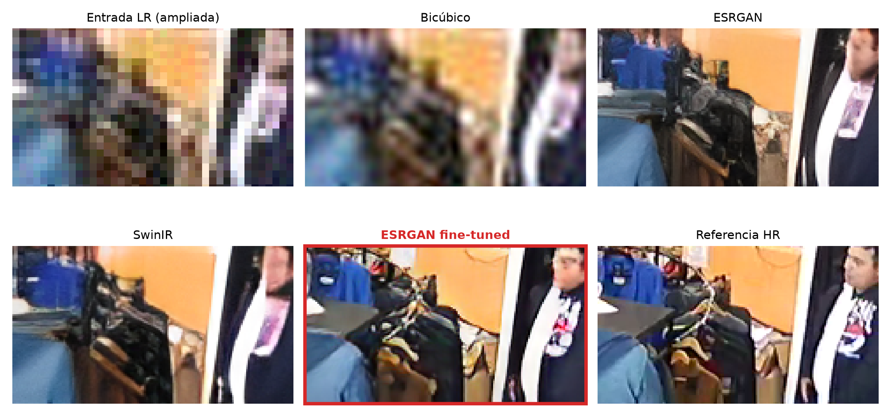
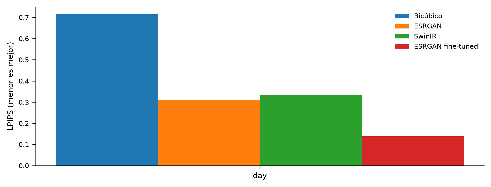
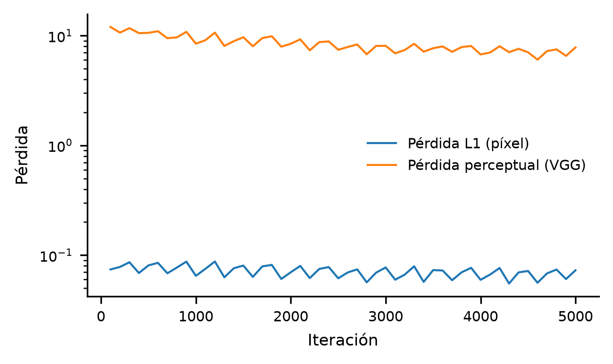

# Mejoramiento de Video en Sistemas de Videovigilancia


Proyecto de tesis: **"Desarrollo de un modelo de inteligencia artificial para el escalamiento visual en videovigilancia mediante técnicas de superresolución y transformadores visuales"**

- **Autor:** Jose Rodriguez Botello (UFPS, Cúcuta)
- **Director:** Sergio Castro Casadiego (UFPS)
- **Co-director:** Sebastian Rojas-Ortega (University of Delaware)
- **Artículo asociado:** ColCom 2026, aceptado; versión final en preparación (`ColCom Paper/`)

Este documento explica **cómo el proyecto cumple cada uno de los cuatro objetivos específicos del anteproyecto aprobado**, qué scripts implementan cada uno, y qué falta por ejecutar. Los jurados verificarán el cumplimiento de cada objetivo, así que cada sección indica la evidencia concreta que la tesis debe presentar.



---

## Objetivo General

> Desarrollar un modelo de inteligencia artificial basado en técnicas de superresolución y transformadores visuales para escalar la calidad y fluidez de videos de videovigilancia.

**Cómo se cumple:** el pipeline completo combina superresolución con GAN (Real-ESRGAN), superresolución con transformadores visuales (SwinIR), interpolación de fotogramas para fluidez (RIFE) y un fine-tuning propio sobre datos de CCTV. Todo está automatizado en la carpeta `pipeline/` (8 pasos).

---

## Objetivo Específico 1: Preprocesamiento del dataset

> Preprocesar una base de datos de videos de cámaras de seguridad con distintos niveles de calidad, resolución y condiciones de iluminación, garantizando su adecuación para el entrenamiento y validación del modelo.

| Requisito del objetivo | Implementación |
|---|---|
| Videos de cámaras de seguridad | `step1_get_dataset.py` valida los videos en `dataset/raw_videos/` |
| Distintos niveles de calidad y resolución | `step2_prepare_frames.py` aplica degradación sintética con el protocolo estándar de Real-ESRGAN: blur gaussiano (σ=1.5), submuestreo bicúbico ×4, compresión JPEG (q=50) y ruido gaussiano (σ=5). Esto genera pares LR/HR controlados y reproducibles |
| Distintas condiciones de iluminación | Convención de nombres de video: `day_*.mp4`, `night_*.mp4`, `indoor_*.mp4`. El step2 procesa todos los videos de `raw_videos/` y los fotogramas heredan el prefijo, de modo que la condición se propaga por todo el pipeline. La función `config.condition_of()` la extrae del nombre del archivo |
| Adecuación para entrenamiento y validación | Los pares LR/HR de step2 alimentan tanto el fine-tuning (step6) como las métricas (step7) |

> [!IMPORTANT]
> Ya hay un primer video de día (`day_street.mp4`, cámara real, 848x480) con el que se corrió todo el pipeline. **Falta conseguir videos de noche y de interior** (`night_*.mp4`, `indoor_*.mp4`), ponerlos en `dataset/raw_videos/` y volver a correr los steps 1-2 para completar la comparación por condición de iluminación.

**Evidencia para la tesis:** descripción del protocolo de degradación (ya redactado en el paper de ColCom), tabla con número de fotogramas por condición, figura de ejemplo LR vs HR.

---

## Objetivo Específico 2: Diseño del modelo (superresolución + transformadores visuales)

> Diseñar un modelo de inteligencia artificial basado en transformadores visuales y técnicas de superresolución, con el propósito de mejorar la calidad de los videos mediante la optimización de la resolución y la fluidez.

**Cómo se cumple:** el diseño es un pipeline que combina las tres partes que pide el objetivo:

1. **Superresolución con GAN:** Real-ESRGAN ×4 (`step3_esrgan_inference.py`), arquitectura RRDBNet.
2. **Transformadores visuales:** SwinIR-M ×4 (`step5_swinir_inference.py`), modelo oficial basado en Swin Transformer entrenado para superresolución de mundo real. Este es el componente que cumple explícitamente la parte de "transformadores visuales" del título de la tesis.
3. **Fluidez temporal:** RIFE ×2 (`step4_rife_inference.py`), interpolación de fotogramas que duplica la tasa de cuadros.

**Evidencia para la tesis:** diagrama del pipeline (ya existe: `ColCom Paper/figures/pipeline_cctv.png`), descripción de las arquitecturas RRDBNet, Swin Transformer y RIFE (figuras 2 y 3 del paper; falta agregar una figura de la arquitectura SwinIR al documento de tesis).

> [!WARNING]
> La sección 4.1.2 del anteproyecto dice que ya se había implementado una arquitectura transformer, pero en ese momento todavía no se había hecho. Con SwinIR (step5) ya quedó implementada; solo falta corregir la redacción del capítulo para contar lo que realmente se hizo.

---

## Objetivo Específico 3: Entrenamiento del modelo

> Entrenar el modelo de inteligencia artificial utilizando la base de datos seleccionada, aplicando estrategias de optimización y ajuste de hiperparámetros.

**Cómo se cumple:** `step6_finetune_esrgan.py` hace **fine-tuning del generador RealESRGAN_x4plus** sobre los pares LR/HR del dataset propio de CCTV (los de step2), usando el framework oficial basicsr:

- **Pérdidas:** L1 + perceptual (VGG19) + adversarial (discriminador U-Net con normalización espectral).
- **Hiperparámetros ajustables** (definidos en `config.py` y registrados con cada corrida): learning rate (1e-4), batch size (4), iteraciones (5000 por defecto, ajustable con `--iters`), scheduler MultiStepLR con reducción al 80% del entrenamiento.
- El modelo afinado se exporta a `weights/RealESRGAN_x4plus_finetuned.pth` y se evalúa como un método más en step7.

**Requisito:** GPU NVIDIA con CUDA. En la RTX 4070 Ti del equipo local, las 5000 iteraciones tomaron 51 minutos.

**Evidencia para la tesis:** tabla de hiperparámetros, curva de pérdidas del entrenamiento (step8 la genera automáticamente a partir de los logs de basicsr), y comparación cuantitativa preentrenado vs fine-tuned en la Tabla de resultados. El ajuste de hiperparámetros se documenta corriendo al menos dos configuraciones (por ejemplo `--iters 2000` y `--iters 5000`) y reportando cuál dio mejor LPIPS.

---

## Objetivo Específico 4: Validación con métricas y comparación

> Validar el modelo desarrollado mediante métricas cuantitativas como PSNR y SSIM, junto con evaluaciones cualitativas basadas en percepción visual, y comparar los resultados con enfoques tradicionales de mejora de video.

| Requisito del objetivo | Implementación |
|---|---|
| PSNR y SSIM | `step7_compute_metrics.py` calcula PSNR, SSIM y además LPIPS (métrica perceptual) para todos los métodos |
| Evaluación cualitativa | `step8_generate_figures.py` genera tiras de comparación visual por condición de iluminación (entrada LR, cada método, referencia HR) a 300 DPI |
| Comparación con enfoques tradicionales | La interpolación **bicúbica ×4** es la línea base tradicional en todas las tablas y figuras |
| Análisis por condición | step7 agrega resultados por condición (day/night/indoor) además del global, y genera las tablas LaTeX listas para pegar en la tesis |

Los métodos comparados son: bicúbico (tradicional), ESRGAN preentrenado (GAN), SwinIR (transformer) y ESRGAN fine-tuned (modelo propio entrenado).

> [!NOTE]
> Es normal que ESRGAN tenga PSNR menor que el bicúbico (brecha percepción-distorsión, Blau & Michaeli 2018). La superioridad se demuestra con LPIPS y con las comparaciones visuales. Esto ya está explicado en el paper de ColCom y debe explicarse igual en la tesis.

**Evidencia para la tesis:** `output/metrics/thesis_metrics.csv`, `output/metrics/thesis_summary.json`, tablas LaTeX impresas por step7, figuras de `output/thesis_figures/`.

---

## Scripts del pipeline



| Script | Qué hace | Objetivo de la tesis |
|---|---|---|
| `config.py` | Rutas, hiperparámetros y parámetros compartidos. Detecta Colab automáticamente | Todos |
| `step1_get_dataset.py` | Valida los videos fuente en `dataset/raw_videos/` | Obj. 1 |
| `step2_prepare_frames.py` | Extrae fotogramas HR y genera los LR con degradación sintética (blur, bicúbico ×4, JPEG, ruido). También crea la línea base bicúbica | Obj. 1 |
| `step3_esrgan_inference.py` | Superresolución con Real-ESRGAN ×4 preentrenado (GAN) | Obj. 2 |
| `step4_rife_inference.py` | Interpolación de fotogramas con RIFE ×2 (fluidez temporal) | Obj. 2 |
| `step5_swinir_inference.py` | Superresolución con SwinIR ×4 (transformador visual) | Obj. 2 |
| `step6_finetune_esrgan.py` | Fine-tuning de Real-ESRGAN sobre el dataset propio de CCTV, con hiperparámetros documentados. Exporta los pesos afinados y corre inferencia | Obj. 3 |
| `step7_compute_metrics.py` | PSNR/SSIM/LPIPS de los cuatro métodos, global y por condición de iluminación. Imprime las tablas LaTeX de la tesis | Obj. 4 |
| `step8_generate_figures.py` | Tiras de comparación visual, acercamientos de detalle por condición, gráfica de métricas, curva de pérdidas del entrenamiento y figura de interpolación RIFE, a 300 DPI | Obj. 3 y 4 |
| `step9_evaluate_rife.py` | Mide la calidad de los fotogramas que sintetiza RIFE mediante una prueba de exclusión sobre tripletes consecutivos con movimiento | Obj. 4 |

Aparte, en `figuras_tesis/` están los scripts que producen material específico del documento de tesis:

| Archivo | Qué hace |
|---|---|
| `fig_degradation.py` | Figura del protocolo de degradación sintética (original vs degradado, con detalles) |
| `fig03_gan.tex`, `fig07_ajuste_fino.tex` | Diagramas de bloques en TikZ. Se compilan con `pdflatex` y se convierten con `pdftoppm -png -r 300 -singlefile` |
| `measure_inference_time.py` | Cronometra bicúbico, ESRGAN preentrenado, ESRGAN afinado, SwinIR y RIFE sobre los mismos fotogramas, y registra el pico de memoria de video de cada modelo |
| `table_per_video_metrics.py` | Desglosa las métricas por video con media y desviación estándar, e imprime las tablas LaTeX |

> [!WARNING]
> Los scripts y métricas del artículo de ColCom están en `ColCom Paper/reproducibility/`, separados del pipeline de la tesis. Ahí solo se tocan los archivos cuando la versión final del artículo lo exige, y cada cambio queda anotado en la sección de la versión final. Todo el trabajo de la tesis va en `pipeline/`.

## Orden de ejecución (local, GPU NVIDIA)

```bash
pip install -r pipeline/requirements.txt

python pipeline/step1_get_dataset.py       # valida los videos
python pipeline/step2_prepare_frames.py    # extrae y degrada fotogramas (Obj. 1)
python pipeline/step3_esrgan_inference.py  # ESRGAN preentrenado (Obj. 2)
python pipeline/step4_rife_inference.py    # interpolación RIFE (Obj. 2, fluidez)
python pipeline/step5_swinir_inference.py  # SwinIR transformer (Obj. 2)
python pipeline/step6_finetune_esrgan.py   # entrenamiento/fine-tuning (Obj. 3)
python pipeline/step7_compute_metrics.py   # métricas por método y condición (Obj. 4)
python pipeline/step8_generate_figures.py  # figuras de la tesis (Obj. 3 y 4)
python pipeline/step9_evaluate_rife.py     # calidad de los fotogramas de RIFE (Obj. 4)
```

> [!CAUTION]
> No correr step6 (fine-tuning) mientras la GPU esté ocupada con otro entrenamiento. Los steps de inferencia (3, 4, 5) también usan la GPU, así que conviene esperar a que esté libre.

> [!TIP]
> Si la GPU se queda sin memoria en step5: `--tile 256`. En step6: `--tile 400` para la inferencia.

Notas:
- Todo corre en la máquina local (RTX 4070 Ti, 32 GB de RAM); los scripts se ejecutan desde la carpeta raíz del proyecto y las rutas se resuelven solas.
- Los resultados quedan en `output/metrics/` y `output/thesis_figures/`, listos para el documento.
- `config.py` también detecta Google Colab automáticamente por si algún día se corre allá, pero no es el flujo principal.

---

## Primeros resultados (julio 2026)

El pipeline completo (steps 1 a 8) se ejecutó en la máquina local con tres videos reales de cámaras de seguridad:

| Video | Condición | Resolución | fps |
|---|---|---|---|
| `day_street.mp4` | Día (calle) | 848x480 | 15 |
| `indoor_garaje.mp4` | Interior (garaje) | 640x360 | 20 |
| `indoor_tienda.mp4` | Interior (tienda) | 640x360 | 12 |

Cada video conserva su resolución nativa (step2 ya no fuerza un solo tamaño). Se usaron 60 fotogramas por video, 180 en total, y el fine-tuning con los tres videos tomó 31 minutos para las 5000 iteraciones.

Promedios sobre los 180 fotogramas:

| Método | PSNR (dB) ↑ | SSIM ↑ | LPIPS ↓ |
|---|---|---|---|
| Bicúbica ×4 (referencia) | 18.83 | 0.5274 | 0.6860 |
| ESRGAN ×4 (preentrenado) | 18.28 | 0.5911 | 0.3004 |
| SwinIR ×4 (Transformer) | 18.41 | 0.6106 | 0.2871 |
| **ESRGAN ×4 (fine-tuned)** | **19.67** | **0.7135** | **0.1265** |

Por condición:

| Método | PSNR día | SSIM día | LPIPS día | PSNR interior | SSIM interior | LPIPS interior |
|---|---|---|---|---|---|---|
| Bicúbica ×4 | 20.42 | 0.5133 | 0.7140 | 18.03 | 0.5345 | 0.6721 |
| ESRGAN ×4 | 18.84 | 0.5197 | 0.3112 | 18.00 | 0.6268 | 0.2949 |
| SwinIR ×4 | 18.79 | 0.5168 | 0.3329 | 18.22 | 0.6575 | 0.2642 |
| **ESRGAN ×4 (fine-tuned)** | 20.06 | **0.6045** | **0.1694** | **19.48** | **0.7680** | **0.1050** |

Por video (PSNR en dB, media ± desviación estándar; las tablas completas de SSIM y LPIPS están en `output/metrics/per_video_metrics.csv`):

| Método | day_street | indoor_garaje | indoor_tienda |
|---|---|---|---|
| Bicúbica ×4 | 20.425 ± 0.254 | 18.187 ± 0.019 | 17.869 ± 0.093 |
| ESRGAN ×4 | 18.838 ± 0.196 | 18.220 ± 0.044 | 17.789 ± 0.105 |
| SwinIR ×4 | 18.787 ± 0.191 | 18.740 ± 0.065 | 17.700 ± 0.106 |
| **ESRGAN ×4 (fine-tuned)** | 20.062 ± 0.178 | **20.654 ± 0.083** | **18.299 ± 0.094** |

Tiempos por fotograma y memoria de video (RTX 4070 Ti, entrada de 212x120 a 848x480, 20 fotogramas cronometrados con calentamiento previo, `figuras_tesis/measure_inference_time.py`):

| Método | ms/fotograma | fps | Pico de VRAM |
|---|---|---|---|
| Bicúbica (CPU) | 0.5 | 1854 | n/a |
| ESRGAN ×4 (preentrenado) | 45.5 | 22.0 | 360 MB |
| SwinIR ×4 | 148.2 | 6.7 | 596 MB |
| ESRGAN ×4 (fine-tuned) | 44.7 | 22.4 | 360 MB |
| RIFE (por fotograma interpolado, 848x480) | 14.0 | 71.4 | 274 MB |
| **Pipeline completo por fotograma de entrada** | **51.7** | **19.3** | **< 400 MB** |

El pico de VRAM se mide con `torch.cuda.max_memory_reserved()` tras el calentamiento. Como las etapas corren una después de otra, el pico del pipeline es el mayor de los dos, no la suma. Los valores cambian unas décimas entre ejecuciones; los de la tabla son los de la corrida guardada en `output/metrics/inference_times.json`.

Calidad de los fotogramas que sintetiza RIFE (`pipeline/step9_evaluate_rife.py`, 23 tripletes consecutivos de `day_street.mp4` con movimiento apreciable):

| Método | PSNR | SSIM | LPIPS |
|---|---|---|---|
| Promedio de los dos vecinos | 33.95 | 0.9759 | 0.0161 |
| **RIFE** | **37.12** | **0.9836** | **0.0111** |

Los fotogramas interpolados no tienen referencia, así que se ocultó el fotograma central de cada triplete y se comparó con él. Solo se usan tripletes con movimiento (diferencia media > 3 DN entre los extremos): en los tramos quietos cualquier método acierta y la comparación no dice nada.

Lo que muestran estos números:

- El **modelo afinado ganó en las tres métricas globales** y en SSIM y LPIPS en las dos condiciones. Es la evidencia principal del objetivo 3.
- En PSNR de día el afinado queda 0.4 dB por debajo del bicúbico (20.06 vs 20.42), aunque sigue muy por encima de los otros dos modelos. Hay que reportarlo tal cual.
- ESRGAN y SwinIR preentrenados tienen PSNR menor que el bicúbico pero LPIPS mucho mejor. Es el comportamiento esperado (percepción vs distorsión) y así hay que explicarlo en el capítulo de resultados.
- En interior, SwinIR supera levemente al ESRGAN preentrenado; en día es al revés. Sirve para la discusión de la comparación entre arquitecturas.
- El desglose por video muestra que las dos escenas de interior no se comportan igual: en el garaje el afinado le saca 2.47 dB al bicúbico, en la tienda solo 0.43 dB. La tienda tiene más movimiento y más compresión.
- Las desviaciones estándar son bajas (máximo 0.26 dB en PSNR), o sea que el resultado no depende del fotograma elegido.
- SwinIR cuesta 3.3 veces más tiempo que ESRGAN y no gana en calidad. Es un argumento a favor de la arquitectura elegida.
- Falta la condición de noche (`night_*.mp4`) para completar la comparación.

Comparación visual en interior (región ampliada, cada método):



Métricas por condición y curvas de pérdida del fine-tuning:





Los archivos quedaron en:

- `output/metrics/thesis_metrics.csv` y `thesis_summary.json` (métricas por fotograma y resumen)
- `output/thesis_figures/` (figuras a 300 DPI, listas para la tesis)
- `weights/RealESRGAN_x4plus_finetuned.pth` (pesos del modelo afinado; no está en el repo, se regenera con step6)

---

## Artículo ColCom 2026: versión final (agosto 2026)

El artículo fue aceptado. La versión enviada quedó archivada completa en `ColCom Paper/v1_submitted/` (fuente, bibliografía, figuras y PDF), para poder comparar contra ella. La versión final se prepara sobre `ColCom Paper/main.tex`, con fecha límite del 22 de agosto de 2026 y el mismo límite de 6 páginas incluyendo referencias.

Qué pidieron los dos revisores y cómo se atendió:

| Observación | Qué se hizo |
|---|---|
| Declarar explícitamente que la contribución es la integración y la evaluación, no un algoritmo nuevo | Párrafo nuevo al final de la Introducción y primer párrafo de las Conclusiones |
| Añadir métricas computacionales (ms/fotograma, fps, VRAM) | Dos columnas nuevas en la Tabla I y un párrafo de costo computacional en la Discusión |
| Reconocer las limitaciones de la evaluación | Párrafo nuevo en la Discusión: conjunto de 60 fotogramas de una sola escena diurna, un único protocolo de degradación, y la variación de textura entre fotogramas por procesar cada uno por separado |
| Explicar cómo evaluar los fotogramas que añade RIFE | Prueba de exclusión sobre tripletes consecutivos (`step9_evaluate_rife.py`), reportada en la sección de fluidez temporal |
| Las figuras 2 y 3 no se citaban en el texto | Ahora se citan en la arquitectura del flujo de trabajo y en las subsecciones de cada modelo |

Cambios adicionales que salieron de la revisión completa del texto:

- **Figuras 1, 2 y 3 rehechas en TikZ** (`ColCom Paper/figures/fig1_pipeline.tex`, `fig2_esrgan.tex`, `fig3_rife.tex`, con estilos comunes en `tikzstyles.tex`). Se compilan dentro del propio documento, así que salen vectoriales. Las anteriores tenían errores: rótulos duplicados, ESRGAN dibujado como un perceptrón multicapa cuando es convolucional, un pie que prometía discriminador y pérdida perceptual que no aparecían en el dibujo, y texto ilegible dentro de los fotogramas. La Fig. 2 ahora incluye la conexión residual global del generador, que faltaba. Para revisar las tres al ancho real de columna: `pdflatex preview_tikz.tex` dentro de `figures/`.
- **Figura 6 regenerada** con `ColCom Paper/reproducibility/pipeline/step8_temporal_figure.py`. La anterior interpolaba entre dos de los 60 fotogramas que step2 reparte por toda la grabación, que están separados unos 65 fotogramas; no eran contiguos y por tanto no ilustraban la interpolación temporal. Ahora usa los fotogramas 1269 y 1270 del video, separados 66.7 ms.
- **Descripción del material corregida.** El texto decía "dominio público"; es una grabación propia de una cámara EZVIZ, cuyo logotipo se ve además en las figuras 4 y 5.
- **Contradicción eliminada.** La Discusión afirmaba que el procesamiento "requiere entornos de nube"; todo se ejecutó localmente y ahora se reportan los tiempos medidos.
- Se quitó una cita que no venía al caso (se citaba un artículo de conteo de personas para justificar el número de fotogramas) y se corrigió la afirmación de que los 60 fotogramas cubrían 4 segundos seguidos, cuando están repartidos por toda la grabación.
- `ColCom Paper/reproducibility/pipeline/config.py`: `BASE_DIR` apuntaba dos niveles arriba, correcto cuando la carpeta estaba en la raíz pero roto desde que se movió dentro de `ColCom Paper/`. Ningún script de esa carpeta podía correr. Ya quedó apuntando a la raíz del proyecto.

**Auditoría de la bibliografía.** Se verificaron las 24 entradas del `.bib` una por una contra DBLP y las actas originales. Tres tenían autores equivocados: ESRGAN omitía a Yu Qiao e incluía a Xiaoou Tang, que no es autor; RCAN decía "Ling Wang" en vez de Lichen Wang; y el artículo de conteo de personas decía "Jing Li" y "Liping Huang" en vez de Jingwen Li y Lei Huang. ESRGAN y RIFE se citaban con un enlace a GitHub en lugar de la publicación (ECCV 2018 Workshops pp. 63-79 y ECCV 2022 pp. 624-642). SRGAN, EDSR y RCAN traían la paginación de CVF mezclada con la oficial de las actas; ahora toda la bibliografía usa la paginación oficial. Se quitó la entrada de Google Colaboratory, que ya no se cita. El resto de datos (autores, año, volumen, número, páginas y DOI) se confirmó correcto.

Pendiente de confirmar con la organización: el bloque de copyright de IEEE en la primera página, la validación por PDF eXpress y el formulario de cesión de derechos. El anuncio público de la conferencia no dice nada de eso, así que debe salir del correo de aceptación.

---

## Trabajo pendiente en el documento de tesis

El anteproyecto (`Anteproyecto.pdf`) tiene los capítulos 1 a 4 casi completos. Para convertirlo en tesis falta:

1. **Sección 4.1.2:** corregir la redacción; describe una implementación transformer que en ese momento no existía. Ahora debe describir SwinIR tal como se integró en step5.
2. **Sección 4.4.2:** reemplazar el marcador "AQUÍ IRIA LAS LIBRERIAS UTILIZADAS" con las librerías reales: PyTorch, basicsr, realesrgan, timm, OpenCV, scikit-image, lpips, NumPy, pandas, matplotlib.
3. **Capítulo 5 (Resultados):** escribirlo con las tablas y figuras de steps 7 y 8. El marcador "QUEDAMOS AQUÍ PARA EMPEZAR EL CAPITULO 5" señala dónde.
4. **Capítulo 6 (Conclusiones y trabajo futuro):** redactar a partir de los resultados, incluyendo la discusión percepción-distorsión.
5. **Tabla de contenido:** reparar los "¡Error! Marcador no definido" (actualizar campos en Word).
6. **Cronograma y presupuesto:** llenar las tablas vacías.

---

## Estructura del repositorio

```text
Jose/
├── pipeline/                  Scripts del experimento de la tesis (steps 1-9)
├── dataset/
│   ├── raw_videos/            Videos fuente (nombrar day_*, night_*, indoor_*)
│   ├── frames_hr/             Fotogramas de referencia (ground truth)
│   └── frames_lr/             Fotogramas degradados (entrada)
├── output/
│   ├── bicubic/               Línea base tradicional
│   ├── sr/                    ESRGAN preentrenado
│   ├── swinir/                SwinIR (transformer)
│   ├── sr_finetuned/          ESRGAN afinado (modelo propio)
│   ├── rife/                  Fotogramas interpolados
│   ├── metrics/               CSV y JSON de métricas
│   └── thesis_figures/        Figuras para la tesis (300 DPI)
├── weights/                   Pesos preentrenados y afinados
├── ColCom Paper/              Artículo IEEE (aceptado, versión final en curso)
│   ├── main.tex               Versión final que se está preparando
│   ├── figures/               Figs. 1-3 en TikZ, Figs. 4-6 generadas por el pipeline
│   ├── v1_submitted/          Copia exacta de la versión enviada a revisión
│   └── reproducibility/       Scripts y métricas del artículo, aparte del pipeline de tesis
├── Archive/                   Código viejo fuera de uso (no está en el repo)
└── Anteproyecto.pdf           Anteproyecto aprobado
```
