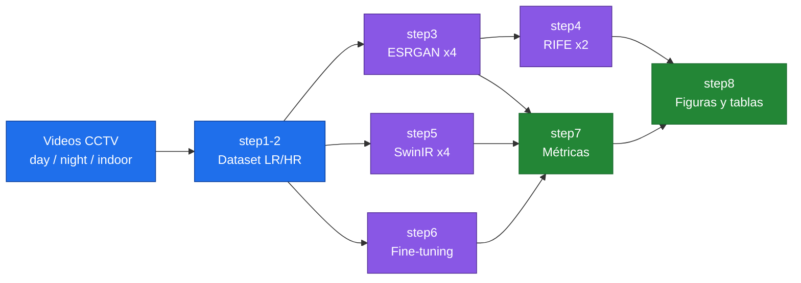
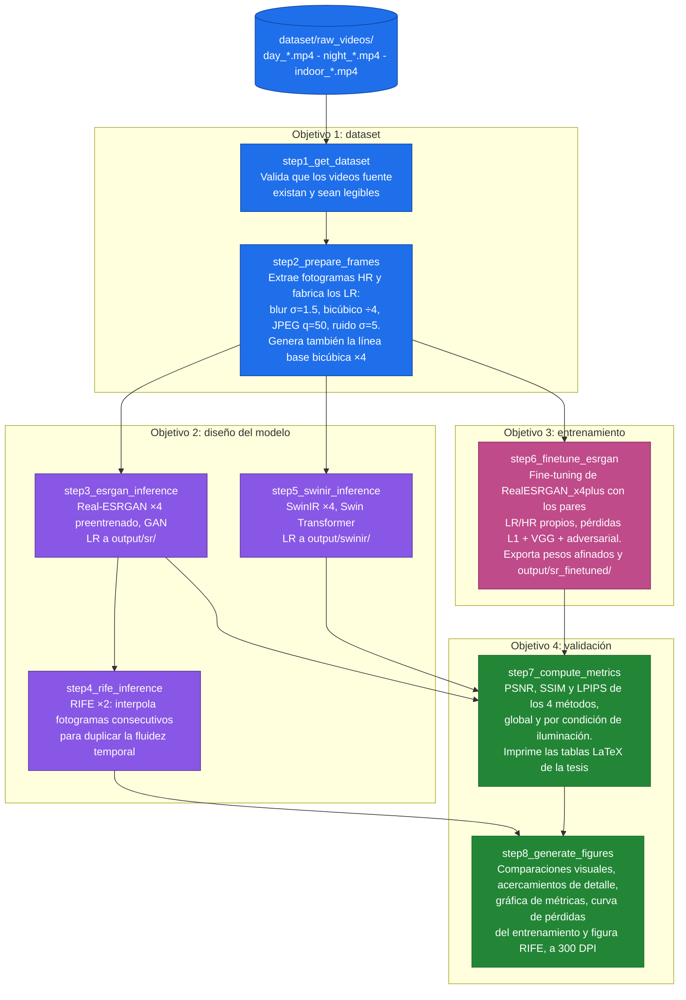

# Mejoramiento de Video en Sistemas de Videovigilancia


Proyecto de tesis: **"Desarrollo de un modelo de inteligencia artificial para el escalamiento visual en videovigilancia mediante técnicas de superresolución y transformadores visuales"**

- **Autor:** Jose Rodriguez Botello (UFPS, Cúcuta)
- **Director:** Sergio Castro Casadiego (UFPS)
- **Co-director:** Sebastian Rojas-Ortega (University of Delaware)
- **Artículo asociado:** ColCom 2026, ya enviado (`ColCom Paper/`)

Este documento explica **cómo el proyecto cumple cada uno de los cuatro objetivos específicos del anteproyecto aprobado**, qué scripts implementan cada uno, y qué falta por ejecutar. Los jurados verificarán el cumplimiento de cada objetivo, así que cada sección indica la evidencia concreta que la tesis debe presentar.



---

## Objetivo General

> Desarrollar un modelo de inteligencia artificial basado en técnicas de superresolución y transformadores visuales para escalar la calidad y fluidez de videos de videovigilancia.

**Cómo se cumple:** el pipeline completo combina superresolución con GAN (Real-ESRGAN), superresolución con transformadores visuales (SwinIR), interpolación de fotogramas para fluidez (RIFE) y un fine-tuning propio sobre datos de CCTV. Todo está automatizado en la carpeta `pipeline/` (8 pasos).

---

## Objetivo Específico 1: Preprocesamiento del dataset

> Preprocesar una base de datos de videos de cámaras de seguridad con distintos niveles de calidad, resolución y condiciones de iluminación, garantizando su adecuación para el entrenamiento y validación del modelo.

| Requisito del objetivo | Implementación |
|---|---|
| Videos de cámaras de seguridad | `step1_get_dataset.py` valida los videos en `dataset/raw_videos/` |
| Distintos niveles de calidad y resolución | `step2_prepare_frames.py` aplica degradación sintética con el protocolo estándar de Real-ESRGAN: blur gaussiano (σ=1.5), submuestreo bicúbico ×4, compresión JPEG (q=50) y ruido gaussiano (σ=5). Esto genera pares LR/HR controlados y reproducibles |
| Distintas condiciones de iluminación | Convención de nombres de video: `day_*.mp4`, `night_*.mp4`, `indoor_*.mp4`. El step2 procesa todos los videos de `raw_videos/` y los fotogramas heredan el prefijo, de modo que la condición se propaga por todo el pipeline. La función `config.condition_of()` la extrae del nombre del archivo |
| Adecuación para entrenamiento y validación | Los pares LR/HR de step2 alimentan tanto el fine-tuning (step6) como las métricas (step7) |

> [!IMPORTANT]
> **Acción pendiente de Jose:** conseguir 3 o 4 videos HD de vigilancia (cámara fija, exterior/interior) y nombrarlos con los prefijos de condición. Fuente sugerida: Pexels (buscar "surveillance camera outdoor", "security camera night", descarga gratuita). Colocarlos en `dataset/raw_videos/` y correr steps 1-2.

**Evidencia para la tesis:** descripción del protocolo de degradación (ya redactado en el paper de ColCom), tabla con número de fotogramas por condición, figura de ejemplo LR vs HR.

---

## Objetivo Específico 2: Diseño del modelo (superresolución + transformadores visuales)

> Diseñar un modelo de inteligencia artificial basado en transformadores visuales y técnicas de superresolución, con el propósito de mejorar la calidad de los videos mediante la optimización de la resolución y la fluidez.

**Cómo se cumple:** el diseño es un **pipeline modular** que integra las tres familias exigidas por el objetivo:

1. **Superresolución con GAN:** Real-ESRGAN ×4 (`step3_esrgan_inference.py`), arquitectura RRDBNet.
2. **Transformadores visuales:** SwinIR-M ×4 (`step5_swinir_inference.py`), modelo oficial basado en Swin Transformer entrenado para superresolución de mundo real. Este es el componente que cumple explícitamente la parte de "transformadores visuales" del título de la tesis.
3. **Fluidez temporal:** RIFE ×2 (`step4_rife_inference.py`), interpolación de fotogramas que duplica la tasa de cuadros.

**Evidencia para la tesis:** diagrama del pipeline (ya existe: `ColCom Paper/figures/pipeline_cctv.png`), descripción de las arquitecturas RRDBNet, Swin Transformer y RIFE (figuras 2 y 3 del paper; falta agregar una figura de la arquitectura SwinIR al documento de tesis).

> [!WARNING]
> La sección 4.1.2 del anteproyecto afirma que ya se implementó una arquitectura transformer, lo cual no era cierto en ese momento. Con SwinIR integrado (step5), esa afirmación queda respaldada, pero la redacción del capítulo debe corregirse para describir lo que realmente se hizo.

---

## Objetivo Específico 3: Entrenamiento del modelo

> Entrenar el modelo de inteligencia artificial utilizando la base de datos seleccionada, aplicando estrategias de optimización y ajuste de hiperparámetros.

**Cómo se cumple:** `step6_finetune_esrgan.py` hace **fine-tuning del generador RealESRGAN_x4plus** sobre los pares LR/HR del dataset propio de CCTV (los de step2), usando el framework oficial basicsr:

- **Pérdidas:** L1 + perceptual (VGG19) + adversarial (discriminador U-Net con normalización espectral).
- **Hiperparámetros ajustables** (definidos en `config.py` y registrados con cada corrida): learning rate (1e-4), batch size (4), iteraciones (5000 por defecto, ajustable con `--iters`), scheduler MultiStepLR con reducción al 80% del entrenamiento.
- El modelo afinado se exporta a `weights/RealESRGAN_x4plus_finetuned.pth` y se evalúa como un método más en step7.

**Requisito:** GPU NVIDIA con CUDA. En la RTX 4070 Ti del equipo local, las 5000 iteraciones deberían tomar alrededor de una hora (estimado; en una T4 de Colab serían 2 a 3 horas).

**Evidencia para la tesis:** tabla de hiperparámetros, curva de pérdidas del entrenamiento (step8 la genera automáticamente a partir de los logs de basicsr), y comparación cuantitativa preentrenado vs fine-tuned en la Tabla de resultados. El ajuste de hiperparámetros se documenta corriendo al menos dos configuraciones (por ejemplo `--iters 2000` y `--iters 5000`) y reportando cuál dio mejor LPIPS.

---

## Objetivo Específico 4: Validación con métricas y comparación

> Validar el modelo desarrollado mediante métricas cuantitativas como PSNR y SSIM, junto con evaluaciones cualitativas basadas en percepción visual, y comparar los resultados con enfoques tradicionales de mejora de video.

| Requisito del objetivo | Implementación |
|---|---|
| PSNR y SSIM | `step7_compute_metrics.py` calcula PSNR, SSIM y además LPIPS (métrica perceptual, va más allá de lo prometido) para todos los métodos |
| Evaluación cualitativa | `step8_generate_figures.py` genera tiras de comparación visual por condición de iluminación (entrada LR, cada método, referencia HR) a 300 DPI |
| Comparación con enfoques tradicionales | La interpolación **bicúbica ×4** es la línea base tradicional en todas las tablas y figuras |
| Análisis por condición | step7 agrega resultados por condición (day/night/indoor) además del global, y genera las tablas LaTeX listas para pegar en la tesis |

Los métodos comparados son: bicúbico (tradicional), ESRGAN preentrenado (GAN), SwinIR (transformer) y ESRGAN fine-tuned (modelo propio entrenado).

> [!NOTE]
> Es normal que ESRGAN tenga PSNR menor que el bicúbico (brecha percepción-distorsión, Blau & Michaeli 2018). La superioridad se demuestra con LPIPS y con las comparaciones visuales. Esto ya está explicado en el paper de ColCom y debe explicarse igual en la tesis.

**Evidencia para la tesis:** `output/metrics/thesis_metrics.csv`, `output/metrics/thesis_summary.json`, tablas LaTeX impresas por step7, figuras de `output/thesis_figures/`.

---

## Scripts del pipeline



| Script | Qué hace | Objetivo de la tesis |
|---|---|---|
| `config.py` | Rutas, hiperparámetros y parámetros compartidos. Detecta Colab automáticamente | Todos |
| `step1_get_dataset.py` | Valida los videos fuente en `dataset/raw_videos/` | Obj. 1 |
| `step2_prepare_frames.py` | Extrae fotogramas HR y genera los LR con degradación sintética (blur, bicúbico ×4, JPEG, ruido). También crea la línea base bicúbica | Obj. 1 |
| `step3_esrgan_inference.py` | Superresolución con Real-ESRGAN ×4 preentrenado (GAN) | Obj. 2 |
| `step4_rife_inference.py` | Interpolación de fotogramas con RIFE ×2 (fluidez temporal) | Obj. 2 |
| `step5_swinir_inference.py` | Superresolución con SwinIR ×4 (transformador visual) | Obj. 2 |
| `step6_finetune_esrgan.py` | Fine-tuning de Real-ESRGAN sobre el dataset propio de CCTV, con hiperparámetros documentados. Exporta los pesos afinados y corre inferencia | Obj. 3 |
| `step7_compute_metrics.py` | PSNR/SSIM/LPIPS de los cuatro métodos, global y por condición de iluminación. Imprime las tablas LaTeX de la tesis | Obj. 4 |
| `step8_generate_figures.py` | Tiras de comparación visual, acercamientos de detalle por condición, gráfica de métricas, curva de pérdidas del entrenamiento y figura de interpolación RIFE, a 300 DPI | Obj. 3 y 4 |

> [!WARNING]
> El pipeline del artículo de ColCom (versión de dos métodos, sin condiciones) quedó congelado en `ColCom Paper/reproducibility/pipeline/`. Esa carpeta no se toca: todo el trabajo de tesis se hace en `pipeline/`.

## Orden de ejecución (local, GPU NVIDIA)

```bash
pip install -r pipeline/requirements.txt

python pipeline/step1_get_dataset.py       # valida los videos
python pipeline/step2_prepare_frames.py    # extrae y degrada fotogramas (Obj. 1)
python pipeline/step3_esrgan_inference.py  # ESRGAN preentrenado (Obj. 2)
python pipeline/step4_rife_inference.py    # interpolación RIFE (Obj. 2, fluidez)
python pipeline/step5_swinir_inference.py  # SwinIR transformer (Obj. 2)
python pipeline/step6_finetune_esrgan.py   # entrenamiento/fine-tuning (Obj. 3)
python pipeline/step7_compute_metrics.py   # métricas por método y condición (Obj. 4)
python pipeline/step8_generate_figures.py  # figuras de la tesis (Obj. 3 y 4)
```

> [!CAUTION]
> No correr step6 (fine-tuning) mientras la GPU esté ocupada con otro entrenamiento. Los steps de inferencia (3, 4, 5) también usan la GPU, así que conviene esperar a que esté libre.

> [!TIP]
> Si la GPU se queda sin memoria en step5: `--tile 256`. En step6: `--tile 400` para la inferencia.

Notas:
- Todo corre en la máquina local (RTX 4070 Ti, 32 GB de RAM); los scripts se ejecutan desde la carpeta raíz del proyecto y las rutas se resuelven solas.
- Los resultados quedan en `output/metrics/` y `output/thesis_figures/`, listos para el documento.
- `config.py` también detecta Google Colab automáticamente por si algún día se corre allá, pero no es el flujo principal.

---

## Trabajo pendiente en el documento de tesis

El anteproyecto (`Anteproyecto.pdf`) tiene los capítulos 1 a 4 casi completos. Para convertirlo en tesis falta:

1. **Sección 4.1.2:** corregir la redacción; describe una implementación transformer que en ese momento no existía. Ahora debe describir SwinIR tal como se integró en step5.
2. **Sección 4.4.2:** reemplazar el marcador "AQUÍ IRIA LAS LIBRERIAS UTILIZADAS" con las librerías reales: PyTorch, basicsr, realesrgan, timm, OpenCV, scikit-image, lpips, NumPy, pandas, matplotlib.
3. **Capítulo 5 (Resultados):** escribirlo con las tablas y figuras de steps 7 y 8. El marcador "QUEDAMOS AQUÍ PARA EMPEZAR EL CAPITULO 5" señala dónde.
4. **Capítulo 6 (Conclusiones y trabajo futuro):** redactar a partir de los resultados, incluyendo la discusión percepción-distorsión.
5. **Tabla de contenido:** reparar los "¡Error! Marcador no definido" (actualizar campos en Word).
6. **Cronograma y presupuesto:** llenar las tablas vacías.

---

## Estructura del repositorio

```text
Jose/
├── pipeline/                  Scripts del experimento de la tesis (steps 1-8)
├── dataset/
│   ├── raw_videos/            Videos fuente (nombrar day_*, night_*, indoor_*)
│   ├── frames_hr/             Fotogramas de referencia (ground truth)
│   └── frames_lr/             Fotogramas degradados (entrada)
├── output/
│   ├── bicubic/               Línea base tradicional
│   ├── sr/                    ESRGAN preentrenado
│   ├── swinir/                SwinIR (transformer)
│   ├── sr_finetuned/          ESRGAN afinado (modelo propio)
│   ├── rife/                  Fotogramas interpolados
│   ├── metrics/               CSV y JSON de métricas
│   └── thesis_figures/        Figuras para la tesis (300 DPI)
├── weights/                   Pesos preentrenados y afinados
├── ColCom Paper/              Artículo IEEE (ya enviado)
│   └── reproducibility/       Copia congelada de scripts y métricas del artículo (no editar)
├── Archive/                   Código viejo fuera de uso (no está en el repo)
└── Anteproyecto.pdf           Anteproyecto aprobado
```
